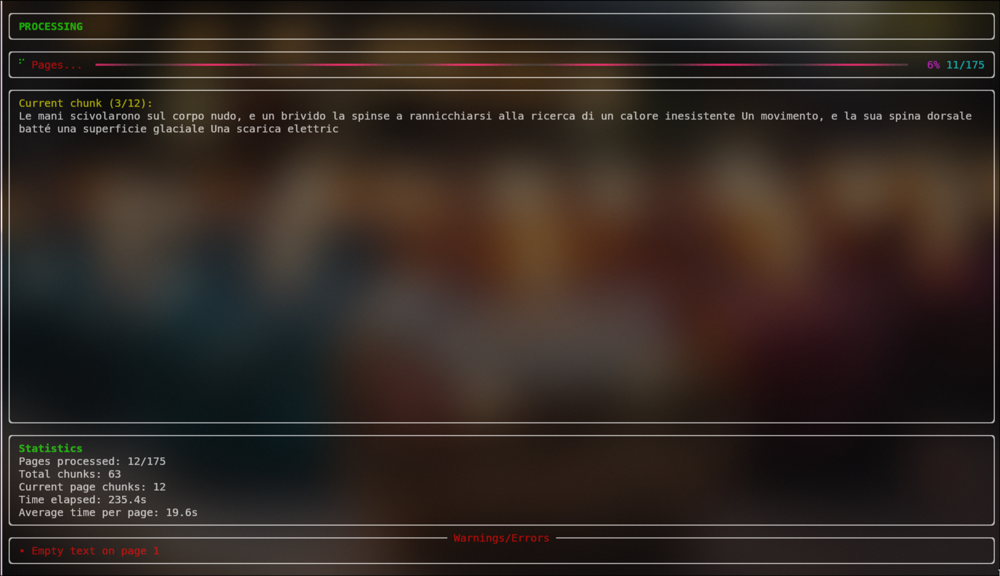

# audiocoqui

A multilingual tool to convert PDF ebooks to audiobooks using XTTS v2 TTS model by cloning a speaker voice.

## Features

- [x] Clone speaker voice
- [x] Keep sentences together
- [x] Clean text input (remove line breaks, etc.)
- [x] Split PDF into pages
- [x] Convert pages to audio
- [x] Add silence between sections
- [x] Concatenate audio files automatically
- [x] Progress tracking and journaling with crash recovery

## Requirements

- Python 3.10+
- pip install -r requirements.txt

## Setup

- Copy .env.example to .env and fill in the missing values
- Download a speaker voice sample and put it in the source_audio folder (any .wav file of more than 10 seconds should work)
- Put your PDF in the proper folder as specified in the .env file

## Usage

NOTE: You can and should clean the output by removing the audio_pages folder after you're done (example in `clean_output` file)

- python src/main.py

## Expected output

- A folder with all the audio pages of the PDF and their chunks if splitted.
- A final audiobook file as specified in the .env file.

## FAQ

### GPU or CPU?

While the model is capable of running on CPU, it's recommended to use a GPU for faster processing.

### Model Size

The model size is slightly smaller than 2GB, so it's recommended to use a GPU with at least 4GB of VRAM or to ensure that your RAM is large enough to handle the model.

### Why we use a lot of small .wav files

We use a lot of small .wav files to enable crash recovery, avoid corruption and to enable progress tracking in a more reliable way.

## License

This project is licensed under the MIT License - see the [LICENSE](LICENSE.md) file for details.

## Credits

- [Coqui XTTS v2](https://huggingface.co/coqui/XTTS-v2)
- [PyTorch](https://pytorch.org/)
- All the authors of the used libraries
